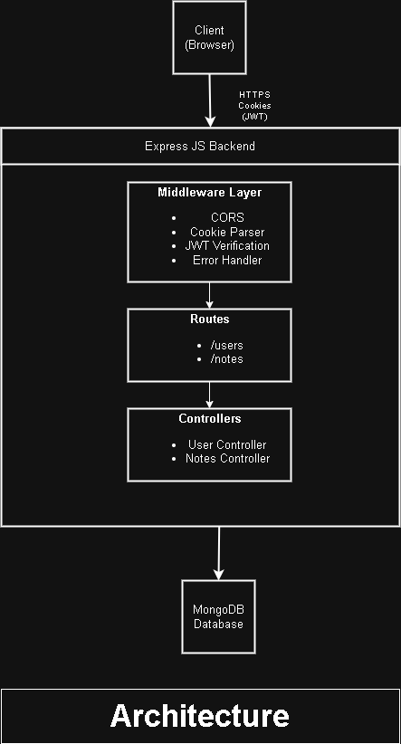
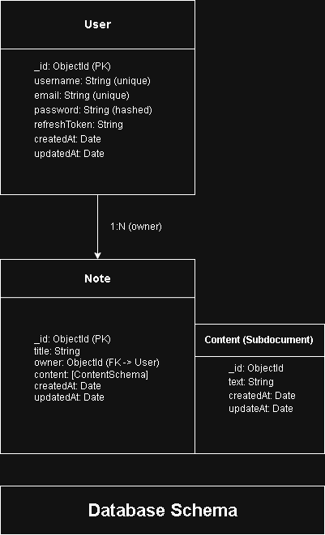
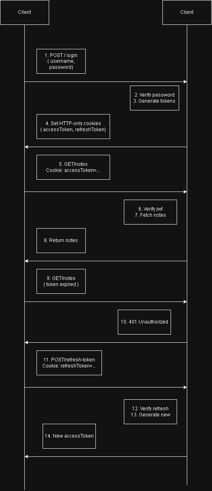
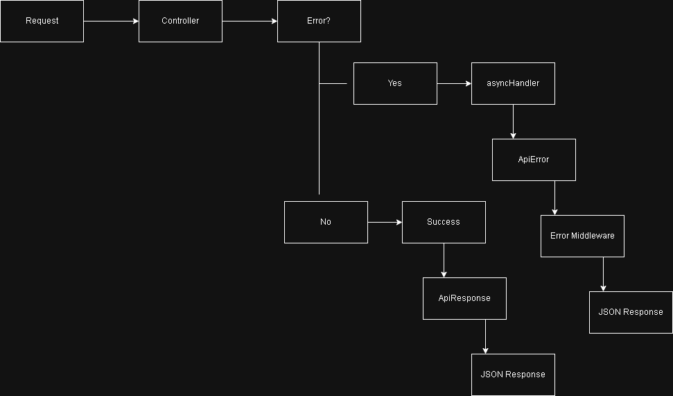
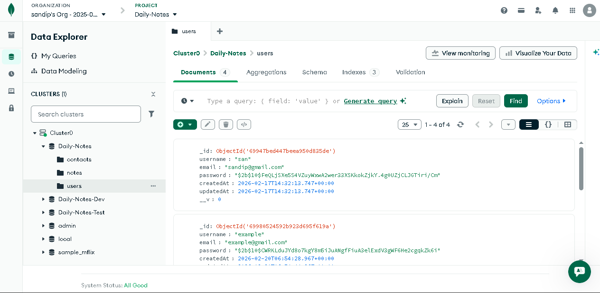
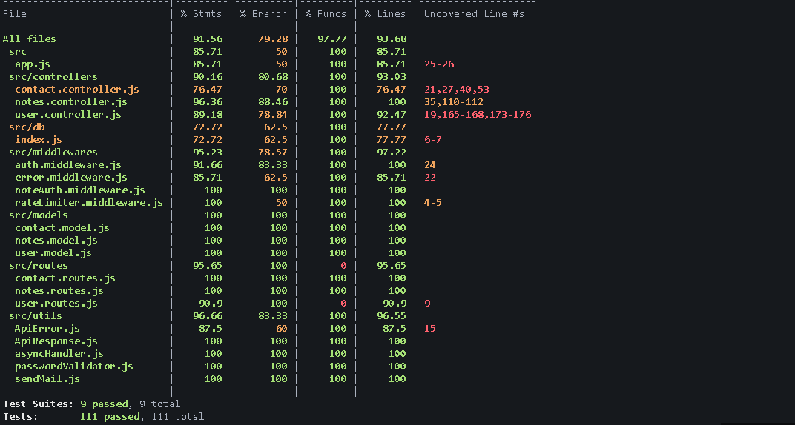
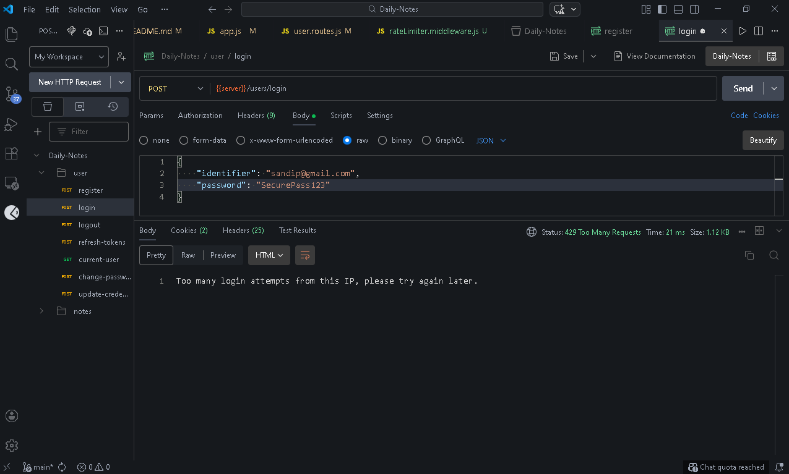

# 📝 Daily-Notes - Backend API

A secure and scalable RESTful API for a note-taking application, built with **Node.js, Express, MongoDB, and JWT authentication**. This project demonstrates clean architecture, proper authorization, and real-world backend practices.

## 🏗 Architecture



## 🗄 Database Schema  



## 🔐 Authentication Flow



## ⚠ Error Handling



## 🗄 MongoDB Schema Design



## 📊 Test Coverage



## 🚦 Rate Limiting




---

## ✨ Features

### 🔐 Authentication & Authorization

* **User Registration** - Create new accounts with username, email, and password
* **Secure Login** - JWT-based authentication with access and refresh tokens
* **Token Refresh** - Automatic token rotation with reuse detection
* **Logout** - Secure session termination with cookie clearing
* **Password Management** - Change password with strength validation
* **Current User** - Get authenticated user details
* **Update Profile** - Update username and credentials
* **Account Deletion** - Permanently delete account and clear session

### 📝 Notes Management

* **Create Notes** - Create notes with optional titles and flexible content input
* **List Notes** - Fetch all notes belonging to the authenticated user (sorted by latest)
* **Update Title** - Modify note titles
* **Delete Notes** - Remove notes with cascade deletion of content
* **Ownership Verification** - Ensure users can only access their own notes

### ✏️ Content Management (Subdocuments)

* **Add Content** - Add single or multiple content items to a note
* **Update Content** - Edit individual content items by ID
* **Delete Content** - Remove specific content items (including middle items)
* **Granular Control** - Each content item has its own ID and timestamps
* **Flexible Input** - Accepts arrays, single strings, or newline-separated strings

### 📬 Contact System

* **Support Requests** - Submit support, feedback, or bug report messages
* **Email Notifications** - Sends email via Nodemailer on each submission
* **Persistent Storage** - Messages saved to database regardless of email outcome
* **Auth Protected** - Only authenticated users can submit contact forms

### 🛡️ Security & Performance

* **Rate Limiting** - Global and auth-specific rate limiting via `express-rate-limit`
* **Security Headers** - Helmet.js with custom Content Security Policy
* **Password Strength** - Enforces minimum length, uppercase, and number requirements
* **HTTP-only Cookies** - Prevents XSS token theft
* **Request Logging** - Morgan HTTP request logger

---

## 🏗️ Tech Stack

### Core Technologies
* **[Node.js](https://nodejs.org/)** - JavaScript runtime
* **[Express.js](https://expressjs.com/)** - Web framework
* **[MongoDB](https://www.mongodb.com/)** - NoSQL database
* **[Mongoose](https://mongoosejs.com/)** - ODM for MongoDB

### Authentication & Security
* **[JWT (jsonwebtoken)](https://www.npmjs.com/package/jsonwebtoken)** - Token-based authentication
* **[bcrypt](https://www.npmjs.com/package/bcrypt)** - Password hashing
* **[Helmet](https://helmetjs.github.io/)** - Security headers & CSP
* **[express-rate-limit](https://www.npmjs.com/package/express-rate-limit)** - Rate limiting
* **HTTP-only cookies** - Secure token storage

### Communication
* **[Nodemailer](https://nodemailer.com/)** - Email notifications (Gmail)
* **[Morgan](https://www.npmjs.com/package/morgan)** - HTTP request logging
* **[CORS](https://www.npmjs.com/package/cors)** - Cross-origin resource sharing

### Testing
* **[Jest](https://jestjs.io/)** - Testing framework
* **[Supertest](https://www.npmjs.com/package/supertest)** - HTTP integration testing

### Development Tools
* **[nodemon](https://nodemon.io/)** - Auto-restart on file changes
* **[dotenv](https://www.npmjs.com/package/dotenv)** - Environment variable management

---

## 📁 Project Structure

```
daily-notes-backend/
├── src/
│   ├── controllers/
│   │   ├── user.controller.js      # User authentication & profile
│   │   ├── notes.controller.js     # Notes & content CRUD
│   │   └── contact.controller.js   # Contact form handling
│   │
│   ├── db/
│   │   └── index.js                # Database connection (dev/test/prod URIs)
│   │
│   ├── middlewares/
│   │   ├── auth.middleware.js       # JWT verification
│   │   ├── noteAuth.middleware.js   # Note & content ownership verification
│   │   └── error.middleware.js      # Global error handler
│   │
│   ├── models/
│   │   ├── user.model.js            # User schema
│   │   ├── notes.model.js           # Note & content subdocument schema
│   │   └── contact.model.js         # Contact message schema
│   │
│   ├── routes/
│   │   ├── user.routes.js           # Auth routes
│   │   ├── notes.routes.js          # Notes routes
│   │   └── contact.routes.js        # Contact routes
│   │
│   ├── utils/
│   │   ├── ApiError.js              # Custom error class
│   │   ├── ApiResponse.js           # Standardized response wrapper
│   │   ├── asyncHandler.js          # Async error wrapper
│   │   ├── passwordValidator.js     # Password strength checker
│   │   └── sendMail.js              # Nodemailer email utility
│   │
│   ├── app.js                       # Express app configuration
│   └── index.js                     # Server entry point
│
├── __tests__/
│   ├── integration/
│   │   ├── controllers/
│   │   │   ├── contact.test.js
│   │   │   ├── notes.test.js
│   │   │   └── user.test.js
│   │   ├── utils/
│   │   │   ├── auth.util.js
│   │   │   └── note.util.js
│   │   └── setup.js
│   └── unit/
│       ├── db/
│       │   └── connectDB.test.js
│       ├── middleware/
│       │   ├── errorHandler.test.js
│       │   └── verifyJWT.test.js
│       └── utils/
│           ├── generateToken.test.js
│           ├── passwordValidator.test.js
│           └── sendMail.test.js
├── .env
├── .env.example
├── .gitignore
├── .prettierignore
├── .prettierrc
├── jest.config.js
├── package.json
├── package-lock.json
└── README.md
```

---

## 🧠 Data Models

### User Model (`user.model.js`)

```javascript
{
  username: String,
  email: String (unique),
  password: String (hashed with bcrypt),
  refreshToken: String,
  createdAt: Date,
  updatedAt: Date
}
```

**Methods:**
* `isPasswordCorrect(password)` - Compare password with hashed
* `generateAccessToken()` - Create short-lived JWT
* `generateRefreshToken()` - Create long-lived JWT with unique `jti`

---

### Note Model (`notes.model.js`)

```javascript
{
  title: String (optional, default: "Untitle"),
  content: [ContentSchema],  // Array of subdocuments
  owner: ObjectId (ref: "User"),
  createdAt: Date,
  updatedAt: Date
}
```

### Content Subdocument

```javascript
{
  _id: ObjectId (auto-generated),
  text: String (required),
  createdAt: Date,
  updatedAt: Date
}
```

---

### Contact Model (`contact.model.js`)

```javascript
{
  userId: ObjectId (ref: "User"),
  type: String (enum: "support" | "feedback" | "bug", default: "support"),
  email: String,
  subject: String,
  message: String,
  createdAt: Date,
  updatedAt: Date
}
```

---

## 🔗 API Endpoints

### Base URL
```
http://localhost:3000/api/v1
```

---
## 📬 Postman Collection

You can quickly test the API using the provided Postman collection.

### Import Steps

1. Open Postman
2. Click **Import**
3. Select the file:

docs/postman/Daily-Notes.postman_collection.json

The collection includes pre-configured requests for:

• User authentication  
• Notes CRUD operations  
• Content management  
• Contact form submission

All requests are grouped by feature for easy testing.
---
### 🔑 Authentication Routes (`/users`)

| Method | Endpoint | Description | Auth Required |
|--------|----------|-------------|---------------|
| POST | `/register` | Create new user account | ❌ |
| POST | `/login` | Login with username/email and password | ❌ |
| POST | `/logout` | Logout and clear tokens | ❌ |
| POST | `/refresh-token` | Refresh access token with rotation | ❌ |
| POST | `/change-password` | Change user password | ✅ |
| GET | `/current-user` | Get authenticated user details | ✅ |
| PUT | `/update-credentials` | Update username | ✅ |
| DELETE | `/delete` | Delete user account | ✅ |
| GET | `/health` | Health check | ❌ |

---

### 📝 Notes Routes (`/notes`)

| Method | Endpoint | Description | Auth Required |
|--------|----------|-------------|---------------|
| POST | `/` | Create new note | ✅ |
| GET | `/` | Get all user's notes | ✅ |
| GET | `/:noteId` | Get single note by ID | ✅ |
| PUT | `/:noteId/title` | Update note title | ✅ |
| DELETE | `/:noteId` | Delete note | ✅ |

---

### 📄 Content Routes (`/notes/:noteId/contents`)

| Method | Endpoint | Description | Auth Required |
|--------|----------|-------------|---------------|
| GET | `/` | Get all contents of a note | ✅ |
| POST | `/` | Add content item(s) to a note | ✅ |
| PUT | `/:contentId` | Update specific content | ✅ |
| DELETE | `/:contentId` | Delete specific content | ✅ |

---

### 📬 Contact Routes (`/contact`)

| Method | Endpoint | Description | Auth Required |
|--------|----------|-------------|---------------|
| POST | `/` | Submit support/feedback/bug message | ✅ |

---

## 📥 Request/Response Examples

### Register User

**Request:**
```http
POST /api/v1/users/register
Content-Type: application/json

{
  "username": "johndoe",
  "email": "john@example.com",
  "password": "SecurePass123"
}
```

**Response:**
```json
{
  "statusCode": 201,
  "data": {
    "_id": "...",
    "username": "johndoe",
    "email": "john@example.com",
    "createdAt": "2026-02-19T10:00:00.000Z"
  },
  "message": "User registered successfully",
  "success": true
}
```

---

### Create Note

**Request:**
```http
POST /api/v1/notes
Cookie: accessToken=...
Content-Type: application/json

{
  "title": "My First Note",
  "content": ["Wake up at 6am", "Exercise for 30 minutes"]
}
```

> **Tip:** `content` can be an array of strings, a single string, or a newline-separated string — all are normalized automatically.

**Response:**
```json
{
  "statusCode": 201,
  "data": {
    "_id": "...",
    "title": "My First Note",
    "content": [
      { "_id": "...", "text": "Wake up at 6am", "createdAt": "..." },
      { "_id": "...", "text": "Exercise for 30 minutes", "createdAt": "..." }
    ],
    "owner": "...",
    "createdAt": "2026-02-19T10:00:00.000Z"
  },
  "message": "Note created successfully",
  "success": true
}
```

---

### Submit Contact Message

**Request:**
```http
POST /api/v1/contact
Cookie: accessToken=...
Content-Type: application/json

{
  "type": "feedback",
  "subject": "Great app!",
  "message": "I really enjoy using Daily Notes."
}
```

**Response:**
```json
{
  "statusCode": 201,
  "data": {
    "_id": "...",
    "userId": "...",
    "type": "feedback",
    "subject": "Great app!",
    "message": "I really enjoy using Daily Notes.",
    "createdAt": "..."
  },
  "message": "Message received successfully",
  "success": true
}
```

---

## 🔒 Security Features

### Authentication
* **JWT tokens** - Stateless authentication
* **Access & Refresh tokens** - Dual-token system for security
* **Token rotation** - Refresh tokens are rotated on every use
* **Reuse detection** - Reusing an old refresh token invalidates the session
* **HTTP-only cookies** - Prevents XSS attacks

### Authorization
* **`verifyJWT` middleware** - Protects all secured routes
* **`verifyNoteOwner` middleware** - Note-level ownership checks
* **`verifyContentOwner` middleware** - Content-level ownership checks

### Request Protection
* **Global rate limiter** - 100 requests per 15 minutes per IP
* **Auth rate limiter** - 10 attempts per 15 minutes on sensitive routes
* **Contact rate limiter** - Additional limiting on contact submissions
* **Helmet.js** - Sets secure HTTP headers with custom CSP

### Password Security
* **bcrypt hashing** - One-way password encryption with 10 salt rounds
* **Strength validation:**
  * Minimum 8 characters
  * At least one uppercase letter
  * At least one number

---

## 📦 Environment Variables

Create a `.env` file in the root directory. See `.env.example` for reference.

```env
# Environment
NODE_ENV=development          # development | test | production

# Server
PORT=8000
CORS_ORIGIN=http://localhost:3000

# Database (separate URIs per environment)
MONGODB_URI_DEV=mongodb://...
MONGODB_URI_TEST=mongodb://...
MONGODB_URI_PROD=mongodb://...
MONGODB_MAX_POOL_SIZE=10
MONGODB_MIN_POOL_SIZE=5

# JWT
ACCESS_TOKEN_SECRET=your_access_secret
ACCESS_TOKEN_EXPIRY=15m
REFRESH_TOKEN_SECRET=your_refresh_secret
REFRESH_TOKEN_EXPIRY=7d

# Rate Limiting
RATE_LIMIT_WINDOW_MS=900000
RATE_LIMIT_MAX_REQUESTS=100

# Email (Gmail)
EMAIL_USER=your@gmail.com
EMAIL_PASS=your_app_password
```

### Generating Secrets

```bash
node -e "console.log(require('crypto').randomBytes(64).toString('hex'))"
```

> **Note:** For Gmail, use an [App Password](https://support.google.com/accounts/answer/185833) rather than your account password.

---

## 🚀 Getting Started

### Prerequisites

* **Node.js** - v18.0.0 or higher
* **MongoDB** - Local installation or MongoDB Atlas account
* **npm** - v9.0.0 or higher

### Installation

1. **Clone the repository**
   ```bash
   git clone https://github.com/Sandip-Roy-29/daily-notes-backend.git
   cd daily-notes-backend
   ```

2. **Install dependencies**
   ```bash
   npm install
   ```

3. **Configure environment variables**
   ```bash
   cp .env.example .env
   # Edit .env with your configuration
   ```

4. **Start MongoDB**
   ```bash
   # If using local MongoDB
   mongod

   # Or use MongoDB Atlas connection string in .env
   ```

5. **Start the server**
   ```bash
   # Development mode (with nodemon)
   npm run dev

   # Production mode
   npm start
   ```

6. **Verify server is running**
   ```
   Server is running on port: 3000
   MongoDB connected !! DB host: <your-db-host>
   ```

---

## 🛠️ Available Scripts

```bash
npm run dev      # Start development server with nodemon
npm start        # Start production server
npm test         # Run all tests
```

---

## 🧪 Testing

The project includes both **unit** and **integration** tests using Jest and Supertest. Tests run against a dedicated `MONGODB_URI_TEST` database, which is fully wiped between each test via `beforeEach` hooks.

```bash
npm test
```

### Integration Tests

| File | Coverage |
|------|----------|
| `user.test.js` | Registration, login, logout, password change, token refresh & reuse detection, account deletion |
| `notes.test.js` | Note & content CRUD, cross-user access protection, invalid/missing IDs |
| `contact.test.js` | Message submission, auth checks, missing field validation |

### Unit Tests

| File | Coverage |
|------|----------|
| `connectDB.test.js` | Successful connection, connection failure handling |
| `errorHandler.test.js` | ApiError and generic errors across all environments |
| `verifyJWT.test.js` | Valid token, missing token, expired/invalid token |
| `generateToken.test.js` | Access token payload, refresh token payload and `jti` |
| `passwordValidator.test.js` | Length, uppercase, and number rules |
| `sendMail.test.js` | Transport configuration, successful send, SMTP failure |

### Testing Utilities

* `auth.util.js` — Creates a user and returns authenticated cookies + userId
* `notes.util.js` — Creates a note directly in the DB for a given userId

---

## 🏛️ Architecture Decisions

### Why Cookie-based Authentication?
* **Security** - HTTP-only cookies prevent XSS token theft
* **Automatic** - Cookies are sent automatically with every request
* **Stateless** - JWT tokens don't require server-side sessions

### Why Subdocuments for Content?
* **Atomic operations** - Update content without a separate collection
* **Performance** - No extra queries for content retrieval
* **Simplicity** - Content always belongs to its parent note

### Why Dual Token System?
* **Security** - Short-lived access tokens limit exposure
* **UX** - Long-lived refresh tokens prevent frequent logins
* **Revocation** - Refresh tokens can be invalidated independently

### Why Separate Test Database?
* **Isolation** - Tests don't pollute development or production data
* **Reliability** - Each test starts with a clean state via `beforeEach` hooks
* **Safety** - No risk of accidentally wiping real data

---

## 🐛 Troubleshooting

### "MongoDB connection failed"
1. Check MongoDB is running: `mongod --version`
2. Verify the correct `MONGODB_URI_*` in `.env` for your `NODE_ENV`
3. Check network access (MongoDB Atlas IP whitelist)

### "JWT malformed" or "Invalid token"
1. Clear browser cookies
2. Login again to get fresh tokens
3. Check `ACCESS_TOKEN_SECRET` and `REFRESH_TOKEN_SECRET` are set

### "Port already in use"
```bash
lsof -ti:8000 | xargs kill -9
# Or change PORT in .env
```

### "CORS error" from frontend
1. Check `CORS_ORIGIN` matches your frontend URL exactly
2. Ensure `credentials: true` in frontend request config
3. Verify cookies are being set in Browser DevTools

### "Too many requests"
The API enforces rate limiting. Wait for the window to reset (15 minutes by default), or adjust `RATE_LIMIT_MAX_REQUESTS` in `.env` during development.

---

## 🎯 What This Project Demonstrates

✅ **REST API Design** - Proper HTTP methods and status codes  
✅ **Authentication vs Authorization** - Clear separation of concerns  
✅ **MongoDB Subdocuments** - When and how to use them  
✅ **Middleware Architecture** - Request processing pipeline  
✅ **Error Handling** - Centralized, environment-aware error management  
✅ **Security Best Practices** - JWT, bcrypt, Helmet, rate limiting  
✅ **Testing** - Unit and integration test coverage with Jest & Supertest  
✅ **Clean Code** - Separation of concerns, reusability  

---

## 🚀 Future Enhancements

- [ ] Pagination for notes list
- [ ] Search functionality
- [ ] Note tags/categories
- [ ] Note sharing between users
- [ ] Email verification on registration
- [ ] Password reset via email
- [ ] API documentation (Swagger/OpenAPI)
- [ ] File uploads (images in notes)

---

## 🤝 Contributing

Contributions are welcome! Please follow these steps:

1. Fork the repository
2. Create a feature branch (`git checkout -b feature/AmazingFeature`)
3. Commit your changes (`git commit -m 'Add some AmazingFeature'`)
4. Push to the branch (`git push origin feature/AmazingFeature`)
5. Open a Pull Request

---

## 👨‍💻 Author

**Sandip Roy**

Backend-focused developer exploring real-world system design through meaningful projects.

* GitHub: [@Sandip-Roy-29](https://github.com/Sandip-Roy-29)
* Email: sandiproyofficial29@gmail.com

---

## 🙏 Acknowledgments

* Express.js team for the excellent web framework
* MongoDB team for the powerful database
* JWT.io for authentication standards
* The Node.js community for continuous innovation

---

## 📞 Support

For support, open an issue on GitHub or use the in-app contact form.

---

> *A simple app, built deeply, teaches more than a complex app built blindly.*

**Happy building!** 🚀

---

**Made with ❤️ using Node.js, Express, and MongoDB**