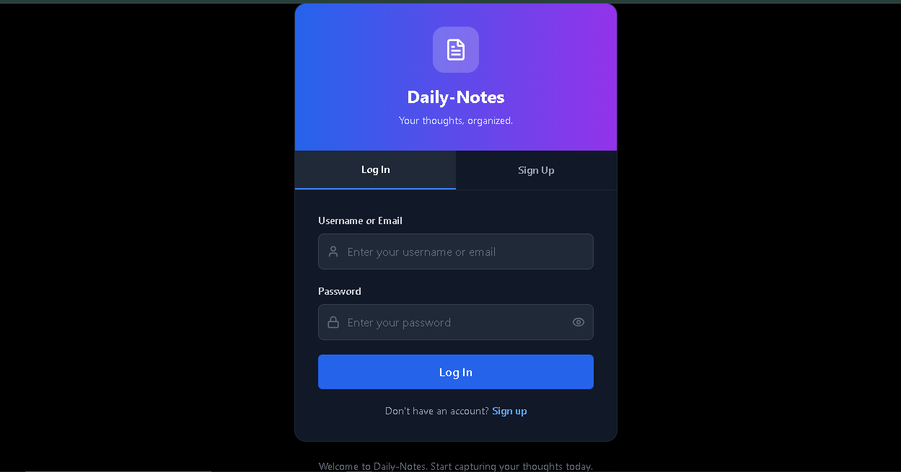
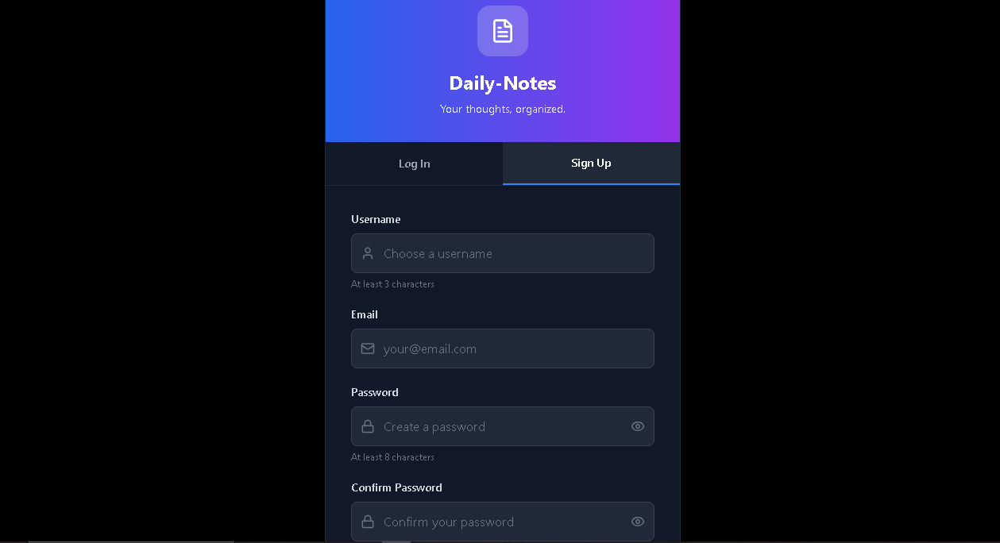
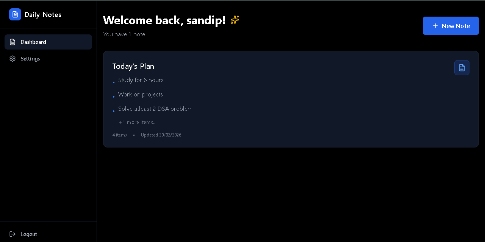
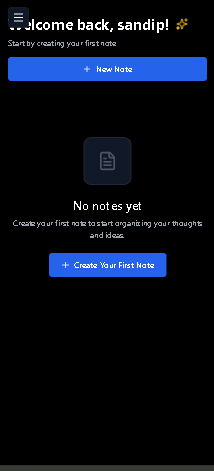
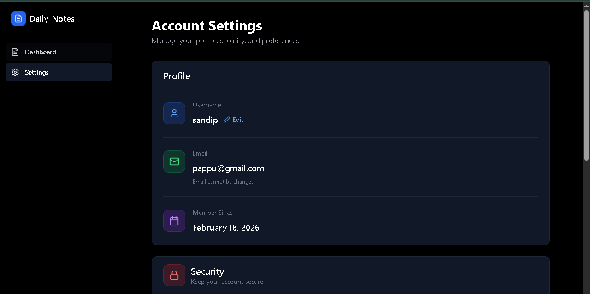
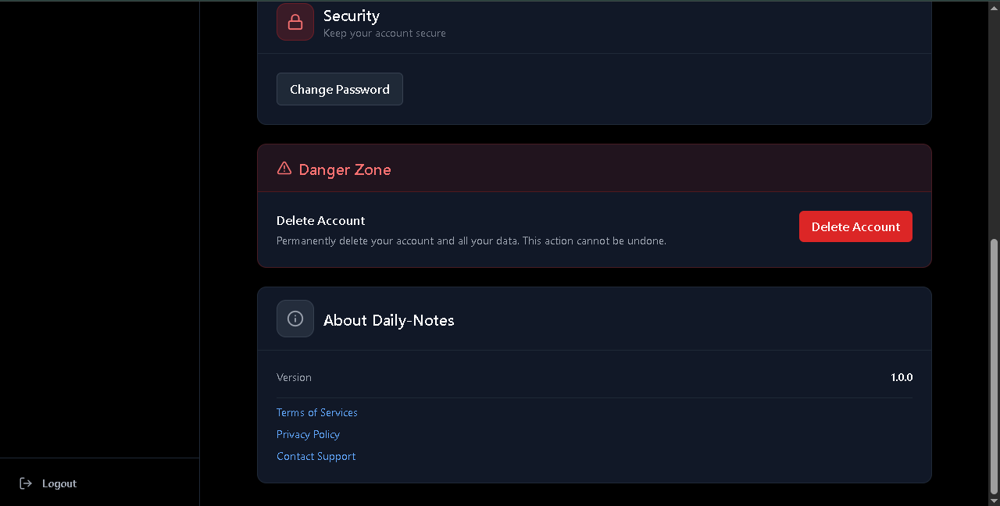
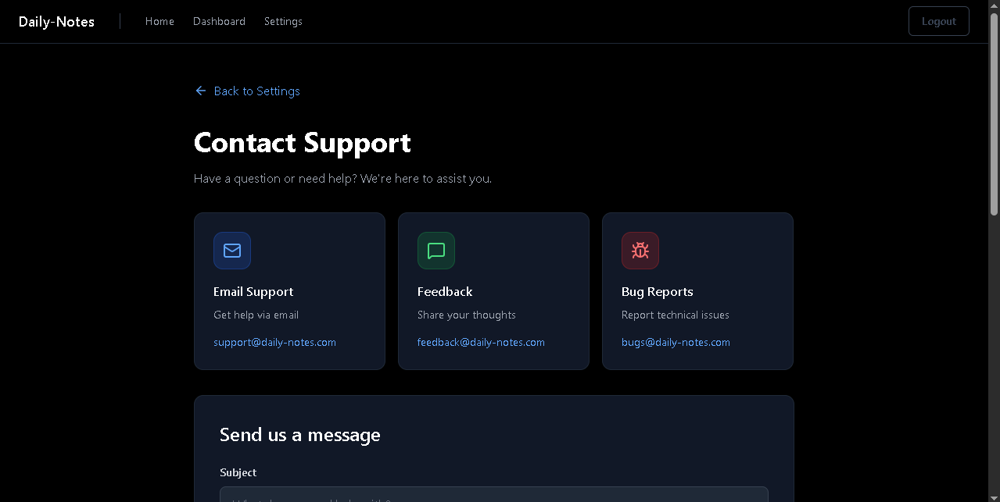
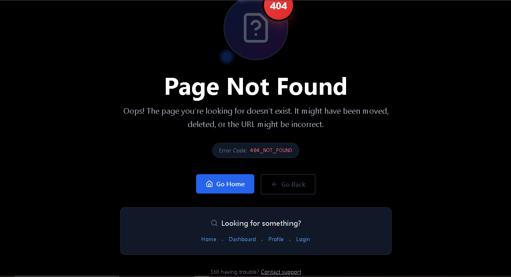

# 📝 Daily-Notes — Frontend

A modern, dark-themed note-taking application built with **React 18 and Vite**. Organize your thoughts, ideas, and tasks with a clean, responsive interface backed by a secure REST API.


## 🖼 Home


## 🔐 Login



## 📝 Register



## 📊 Dashboard



## 📱 Mobile View



## ⚙ Settings




## 📬 Contact



## 🚫 Not Found



---

## ✨ Features

### 🔐 Authentication
- **Login & Register** — Tabbed single-page auth with inline validation
- **Show/Hide Password** — Toggle visibility on all password fields
- **Auto-redirect** — Authenticated users are sent to dashboard automatically
- **Axios Interceptors** — Silent token refresh on 401; retries original request
- **Persistent Session** — Auth state restored on page reload via `/current-user`

### 📓 Notes Management
- **Dashboard** — Lists all notes with title, preview (first 3 items), item count, and last updated date
- **Create Note** — Modal form with optional title and multi-line content input
- **Note Detail** — Full note view with inline title editing and per-item content management
- **Delete Note** — Confirmation modal with warning before permanent deletion
- **Abort Controller** — Cancels in-flight API requests on component unmount

### ✏️ Content Management
- **Add Content** — Inline textarea form within the note detail page
- **Edit Content** — Per-item inline editing with save/cancel controls
- **Delete Content** — Per-item deletion with confirmation modal
- **Live Updates** — All mutations update the note state from fresh API response

### ⚙️ Settings (Single Page)
- **Edit Username** — Inline form with validation and success feedback
- **Change Password** — Inline form with show/hide toggles; auto-logout on success
- **Delete Account** — Protected by typing `DELETE` in a confirmation input
- **About Section** — App version, Terms, Privacy Policy, Contact Support links

### 📬 Contact & Support
- **Message Types** — Support, Feedback, Bug Report (card-based selector)
- **Contact Form** — Subject + message with context-aware placeholders
- **Success/Error Feedback** — Inline alerts; success auto-hides after 5 seconds
- **Alternative Channels** — GitHub Issues link and direct email

### 🎨 UI/UX
- **Dark Theme** — Black and gray-900 throughout, no light mode
- **Responsive Sidebar** — Fixed on desktop, overlay with hamburger on mobile
- **Skeleton Loaders** — Pulse animations for notes and profile loading states
- **Confirmation Modals** — For note deletion and content deletion
- **Empty States** — Friendly prompts when no notes exist
- **404 Page** — Custom not-found page with helpful navigation links

---

## 🏗️ Tech Stack

| Category | Technology |
|----------|------------|
| UI Library | React 19.2.0 |
| Build Tool | Vite 7.2.4 |
| Routing | React Router 7.13.0 |
| Styling | TailwindCSS 3.4.19 |
| HTTP Client | Axios 1.13.4 |
| Icons | Lucide React 0.564.0 |
| State | React Context API + useState/useEffect |

---

## 📁 Project Structure

```
daily-notes-frontend/
├── src/
│   ├── api/
│   │   ├── axios.js
│   │   ├── auth.api.js
│   │   ├── contact.api.js
│   │   └── note.api.js
│   │
│   ├── components/
│   │   ├── layout/
│   │   │   ├── AppLayout.jsx
│   │   │   ├── AuthLayout.jsx
│   │   │   ├── Navbar.jsx
│   │   │   ├── ProtectedRoute.jsx
│   │   │   ├── PublicLayout.jsx
│   │   │   └── Sidebar.jsx
│   │   │
│   │   ├── notes/
│   │   │   ├── NoteIteam.jsx
│   │   │   ├── NoteList.jsx
│   │   │   └── NotesSkeleton.jsx
│   │   │
│   │   ├── profile/
│   │   │   ├── ChangePasswordForm.jsx
│   │   │   ├── EditProfileForm.jsx
│   │   │   ├── ProfileInfo.jsx
│   │   │   └── ProfileSkeleton.jsx
│   │   │
│   │   └── ui/
│   │       ├── Button.jsx
│   │       ├── Card.jsx
│   │       ├── EmptyState.jsx
│   │       ├── Input.jsx
│   │       ├── Loader.jsx
│   │       ├── Modal.jsx
│   │       └── Textarea.jsx
│   │
│   ├── context/
│   │   ├── AuthContext.js
│   │   ├── AuthProvider.jsx
│   │   ├── CurrentNoteContext.js
│   │   └── CurrentNoteProvider.jsx
│   │
│   ├── hooks/
│   │   ├── useAuth.js
│   │   ├── useCurrentNote.js
│   │   └── useNotes.js
│   │
│   ├── pages/
│   │   ├── Auth.jsx
│   │   ├── Contact.jsx
│   │   ├── Dashboard.jsx
│   │   ├── Home.jsx
│   │   ├── NoteDetail.jsx
│   │   ├── NotFound.jsx
│   │   ├── Privacy.jsx
│   │   ├── Settings.jsx
│   │   └── Terms.jsx
│   │
│   ├── routes/
│   │   └── AppRoutes.jsx
│   │
│   ├── utils/
│   │   └── helper.js
│   │
│   ├── App.jsx
│   ├── index.css
│   └── main.jsx
│
├── .env
├── .env.example
├── .gitignore
├── eslint.config.js
├── index.html
├── package.json
├── package-lock.json
├── postcss.config.js
├── tailwind.config.js
├── vite.config.js
└── README.md
```

---

## 🗺️ Routes

### Public Routes (with Navbar)
| Path | Page | Description |
|------|------|-------------|
| `/` | `Home` | Landing page with hero, features, how it works, footer |
| `/terms` | `Terms` | Terms of Service |
| `/privacy` | `Privacy` | Privacy Policy |

### Auth Route (no Navbar)
| Path | Page | Description |
|------|------|-------------|
| `/auth` | `Auth` | Login / Register tabs |

### Protected Routes (requires authentication, with Sidebar)
| Path | Page | Description |
|------|------|-------------|
| `/dashboard` | `Dashboard` | All notes list + create note |
| `/notes/:noteId` | `NoteDetail` | Note view/edit with content management |
| `/settings` | `Settings` | Profile, password, delete account, about |
| `/contact` | `Contact` | Support/feedback/bug form |

### Fallback
| Path | Page |
|------|------|
| `*` | `NotFound` — 404 page |

---

## 🔐 Authentication Flow

```
1. App loads → AuthProvider calls GET /users/current-user
   ↓
2. 200 → user state set, isAuth = true
   401 → user = null, isAuth = false (normal, not logged in)
   ↓
3. ProtectedRoute checks isAuth
   → false: redirect to /auth
   → true: render page
   ↓
4. On any protected API call that returns 401:
   → Axios interceptor fires (only once per request)
   → POST /users/refresh-token
   → Retry original request
   ↓
5. If refresh also fails:
   → Error propagated (user redirected to /auth by ProtectedRoute)
```

---

## 🧩 State Management

The app uses **React Context** for global state — no Redux or Zustand.

**`AuthProvider`** manages:
- `user` — current user object or `null`
- `isAuth` — boolean derived from `!!user`
- `authLoading` — true during initial `/current-user` fetch
- `actionLoading` — true during login/register/logout/update actions
- `authError` / `actionError` — error strings

**`CurrentNoteProvider`** manages:
- `currentNote` — the full note object being viewed
- `loading` / `error` — for the note detail page
- All note mutation functions (update title, add/edit/delete content)

**`useNotes`** hook manages:
- Local state for the notes list in Dashboard
- Fetches on mount with AbortController cleanup

---

## 📥 Getting Started

### Prerequisites
- **Node.js** v18.0.0 or higher
- **npm** v9.0.0 or higher
- **Backend server** running (see [Daily-Notes Backend](https://github.com/Sandip-Roy-29/Daily-Notes/tree/main/Daily-Notes-Backend))

### Installation

1. **Clone the repository**
   ```bash
   git clone https://github.com/Sandip-Roy-29/daily-notes-frontend.git
   cd daily-notes-frontend
   ```

2. **Install dependencies**
   ```bash
   npm install
   ```

3. **Configure environment variables**
   ```bash
   cp .env.example .env
   ```
   Edit `.env`:
   ```env
   VITE_API_BASE_URL=http://localhost:3000/api/v1
   ```

4. **Start the development server**
   ```bash
   npm run dev
   ```

5. **Open in browser**
   ```
   http://localhost:5173
   ```

---

## 🛠️ Available Scripts

```bash
npm run dev        # Start development server (http://localhost:5173)
npm run build      # Build for production → dist/
npm run preview    # Preview production build locally
npm run lint       # Run ESLint
```

---

## 📦 Environment Variables

```env
# Required — must match your backend server URL
VITE_API_BASE_URL=http://localhost:3000/api/v1
```

> All Vite environment variables must be prefixed with `VITE_` to be accessible in the app.

---

## 🎨 Design System

### Color Palette (Dark Theme)
```
Background     bg-black          #000000
Card           bg-gray-900       #111827
Input          bg-gray-800       #1f2937
Hover          bg-gray-700       #374151
Primary text   text-white        #ffffff
Secondary      text-gray-400     #9ca3af
Muted          text-gray-500     #6b7280
Border         border-gray-800   #1f2937
Primary action bg-blue-600       #2563eb
Danger action  bg-red-600        #dc2626
```

### UI Components

| Component | Variants |
|-----------|----------|
| `Button` | `primary` (blue), `danger` (red), `outline` (gray border) |
| `Card` | `Card`, `CardHeader`, `CardContent`, `CardFooter` |
| `Input` | Label, value, error, placeholder |
| `Textarea` | Label, rows, error, placeholder |
| `Modal` | Title, isOpen, onClose, children |
| `Loader` | Blue spinning ring, centered |
| `EmptyState` | Title, description, optional action |

---

## 🐛 Troubleshooting

### "Network Error" or "CORS Error"
1. Confirm the backend is running on the correct port
2. Check `VITE_API_BASE_URL` in `.env` matches your backend URL
3. Verify backend CORS is set to `http://localhost:5173`

### "401 Unauthorized" on every request
1. Clear all browser cookies for `localhost`
2. Log in again — a fresh access + refresh token pair will be set
3. Check Browser DevTools → Application → Cookies to confirm cookies are present

### Changes not reflecting after update
```bash
# Hard refresh
Ctrl + Shift + R   # Windows/Linux
Cmd + Shift + R    # Mac

# Clear Vite cache
rm -rf node_modules/.vite
npm run dev
```

### ESLint warnings on startup
```bash
npm run lint -- --fix   # Auto-fix where possible
```

---

## 🚀 Deployment

```bash
npm run build   # Outputs to dist/
```

### Vercel
```bash
npm install -g vercel
vercel --prod
```

### Netlify
```bash
npm install -g netlify-cli
netlify deploy --prod --dir=dist
```

> Set `VITE_API_BASE_URL` to your production backend URL in your hosting provider's environment variable settings.

---

## 🗺️ Roadmap

- [ ] Search notes by title or content
- [ ] Note tags and categories
- [ ] Rich text editor
- [ ] Export notes as PDF or Markdown
- [ ] Light/Dark theme toggle
- [ ] Note sharing between users
- [ ] Mobile app (React Native)

---

## 🤝 Contributing

1. Fork the repository
2. Create a feature branch (`git checkout -b feature/AmazingFeature`)
3. Commit your changes (`git commit -m 'Add some AmazingFeature'`)
4. Push to the branch (`git push origin feature/AmazingFeature`)
5. Open a Pull Request

---

## 👨‍💻 Author

**Sandip Roy**

Backend-focused developer exploring real-world system design through meaningful projects.

- GitHub: [@Sandip-Roy-29](https://github.com/Sandip-Roy-29)
- Email: sandiproyofficial29@gmail.com

---

## 🙏 Acknowledgments

- React team for the excellent UI library
- Vite team for the blazing fast build tool
- TailwindCSS team for the utility-first CSS framework
- Lucide team for the clean icon set

---

## 📞 Support

Open an issue on GitHub or use the in-app **Contact & Support** page at `/contact`.

---

> *A simple app, built deeply, teaches more than a complex app built blindly.*

**Made with ❤️ using React, Vite, and TailwindCSS**